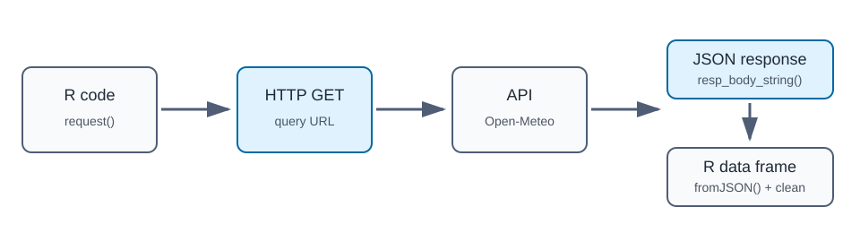

## Description

An **API** (Application Programming Interface) is a structured way for one program to request data from another program or web service. In this cycle, we will use the **Open-Meteo API** to request recent weather data, parse the JSON response, repeat the request for multiple cities with `purrr`, add date features with `lubridate`, and compare a few plot types.

------------------------------------------------------------------------

### Motivating Questions

**Subtask 1** — What do daily high and low temperature trends look like across several California cities?

**Subtask 2** — How does the relationship between daily temperature range and precipitation differ across cities?

**Subtask 3** — Are days with larger temperature ranges also days with more or less precipitation?

------------------------------------------------------------------------

## Setup — Libraries

```{r}
library(httr2)     ## Data Extraction  — building and sending HTTP requests
library(jsonlite)  ## Data Extraction  — parsing JSON responses
library(purrr)     ## Data Extraction  — repeating the same request
library(dplyr)     ## Data Transformation
library(lubridate) ## Data Transformation — date parsing and date features
library(tidyr)     ## Data Transformation — pivot_longer for tidy visualization
library(ggplot2)   ## Data Visualization
```

::: callout-important
## The Extraction Is the Heavy Hitter

In this cycle, most of the intellectual work happens in **Extraction (E)**: understanding the API, building the request, checking the response, parsing JSON, and repeating the workflow for multiple cities.

**Reflection.** Why is the Extraction (E) step emphasized as the most important — the "heavy hitter" — part of this ETV cycle? Answer in 2–3 sentences.

> **Your answer:** The Extraction step requires us to understand a new tool (an API), build a correctly structured HTTP request, interpret the JSON response, and then generalize that process using `purrr`. The Transformation and Visualization steps use familiar tidyverse functions we have seen before; the new intellectual work is entirely in getting the data out of the API and into a usable shape. Without a clean extraction, there is nothing to transform or visualize.
:::

------------------------------------------------------------------------

## Extraction (E)

#### Learning Moment 0 — What Is an API?

An **API** lets us ask a service for data in a structured way. Instead of manually downloading a spreadsheet, we send a request to a URL and include arguments that describe what data we want.

For this cycle, we use Open-Meteo:

<https://open-meteo.com/>

Open-Meteo is useful here because it does not require an API key and it can return daily weather variables for a specific latitude and longitude.

**Side Q1.** Why might an API be better than manually downloading a file?

<!-- [Place Answer - Begin] -->

An API can be better when the data changes often, when we want to automate repeated pulls, or when we need to request only a specific slice of data. It also lets us change inputs, such as city or date range, without manually finding and downloading a new file each time.

<!-- [Place Answer - End] -->

------------------------------------------------------------------------

#### Learning Moment 1 — Request, Response, and JSON

The basic API workflow has three pieces:

1.  A **request**: what we ask the API for.
2.  A **response**: what the API sends back.
3.  A **JSON body**: the text format that stores the returned data.

<!-- TODO: confirm image URL -->

{fig-alt="Diagram showing R code making an HTTP GET request to an API, receiving JSON, and converting it into an R data frame." width="90%"}

```{r}
# (a) making request
base_request <- request("https://api.open-meteo.com/v1/forecast")

# (b) by default GET
base_request
```

**Annotation (a).** What does `request(...)` do at this step?

> **Your answer:** `request()` creates an `httr2` request object pointed at the base URL. No network call is made yet; this just sets the starting address that will be built on before sending.

**Annotation (b).** Why is the default HTTP method GET here?

> **Your answer:** GET is the HTTP method used to retrieve data without changing anything on the server. Since we are only asking for weather data and not submitting or modifying anything, GET is the correct and default choice.

**Q1.** What is JSON, and why is it common for API responses?

<!-- [Place Answer - Begin] -->

**JSON** (JavaScript Object Notation) is a lightweight text format that stores data as nested key-value pairs and arrays. APIs use JSON because it is compact, readable, and easy for many programming languages, including R, to parse.

<!-- [Place Answer - End] -->

------------------------------------------------------------------------

#### Learning Moment 2 — Planning the Query First

Before sending a request, write down the pieces the API needs. For weather data, we need a location, variables, units, time zone, and date range.

```{r}
# (a) location information
city_name <- "San Luis Obispo"
latitude <- 35.2828
longitude <- -120.6596

# (b) requested daily weather variables
daily_variables <- c(
  "temperature_2m_max",
  "temperature_2m_min",
  "precipitation_sum"
)

city_name
daily_variables
```

**Annotation (a).** What does the `city_name` / `latitude` / `longitude` group define?

> **Your answer:** They define the target location — the human-readable city name for labeling the data, and the geographic coordinates the API needs to find the correct weather station.

**Annotation (b).** What does `daily_variables` define, and why store it separately?

> **Your answer:** `daily_variables` defines which weather metrics we want the API to return. Storing it as a separate object keeps the request code cleaner and makes it easy to add or remove variables in one place without editing the request chain directly.

**Q2.** Why is it helpful to save query inputs as objects before building the request?

<!-- [Place Answer - Begin] -->

Saving query inputs as objects makes the code easier to read and easier to change. If we want a different city or a different daily variable, we can edit one object instead of hunting through a long request.

<!-- [Place Answer - End] -->

------------------------------------------------------------------------

#### Learning Moment 3 — Doing One Query First

Now we build and send one request. This step is intentionally just one city, because it is easier to debug one working request before repeating it.

```{r}
single_city_request <- base_request |>
  req_url_query(
    # (a) from before
    latitude           = latitude,
    longitude          = longitude,
    daily              = daily_variables,
    # (b) constant information
    temperature_unit   = "fahrenheit",
    precipitation_unit = "inch",
    timezone           = "America/Los_Angeles",
    past_days          = 30,
    forecast_days      = 1,
    .multi             = "comma"
  )

single_city_response <- single_city_request |>
  # (c)
  req_perform()

# (d)
resp_status(single_city_response)
```

**Annotation (a).** Which earlier objects are reused inside `req_url_query()`?

> **Your answer:** `latitude` and `longitude` (defined in LM 2) and `daily_variables` (also from LM 2) are passed directly into `req_url_query()`.

**Annotation (b).** Why are `temperature_unit`, `precipitation_unit`, `timezone`, `past_days`, and `forecast_days` treated as constants here?

> **Your answer:** These values do not change between cities — we always want Fahrenheit, inches, Pacific time, and the same date window. Because they are the same for every request, it makes sense to set them once as fixed values rather than making them arguments that callers must supply.

**New Q1.** Explain the difference between `request()`, `req_url_query()`, and `req_perform()`.

| Function | Your explanation |
|------------------------------------|------------------------------------|
| `request()` | Creates an `httr2` request object pointed at a base URL. No network call is made; it just sets the starting address. |
| `req_url_query()` | Attaches query parameters to the request URL, narrowing what data the API returns (location, variables, units, date range). |
| `req_perform()` | Sends the fully built request to the server over the network and returns the response object containing status and body. |

**Q3.** What does an HTTP status code of `200` indicate?

<!-- [Place Answer - Begin] -->

A status code of `200` means the request was successful. The server understood the request and returned a response.

<!-- [Place Answer - End] -->

------------------------------------------------------------------------

#### Learning Moment 4 — Arguments Needed for `req_url_query()`

`req_url_query()` adds query parameters to the request URL. Each argument narrows or shapes the data returned by the API.

```{r}
# (a) JSON text -> R list
single_city_json <- single_city_response |>
  resp_body_string()

single_city_list <- single_city_json |>
  fromJSON()

names(single_city_list)
```

```{r}
# (c)
single_city_daily <- single_city_list[["daily"]]

# (d) type and extraction: list -> data frame -> cleaned data frame
single_city_weather_df <- as.data.frame(single_city_daily) |>
  rename(date = time) |>
  mutate(
    date = ymd(date),
    city = city_name,
    # (e)
    .before = 1
  )

glimpse(single_city_weather_df)
```

**Annotation (a).** Explain what `single_city_list` is and how it is structured.

> **Your answer:** `single_city_list` is an R list produced by parsing the JSON text. Each top-level element — such as `latitude`, `longitude`, `elevation`, and `daily` — corresponds to one key in the original JSON object. The `daily` element is itself a nested list of named vectors, one per weather variable.

**Annotation (b).** What is the data type at each step, and what is being extracted?

> **Your answer:** `resp_body_string()` returns a character string (raw JSON text). `fromJSON()` converts that string into an R list. `single_city_list[["daily"]]` extracts the `daily` element from the list, which contains named numeric and character vectors for each requested weather variable.

**Annotation (c).** Why do we extract `daily` specifically?

> **Your answer:** The API response contains several top-level keys — latitude, longitude, elevation, timezone metadata, and `daily`. The `daily` key holds the actual day-by-day weather data we need; the other keys are metadata about the location and request, not the observations themselves.

**Annotation (e).** Why `.before = 1`? What does it control?

> **Your answer:** `.before = 1` tells `mutate()` to place the newly created columns (`date` and `city`) before the first existing column in the data frame. Without it, new columns would be appended to the right side, making the data frame harder to read at a glance.

**Side Q2.** What do the main `req_url_query()` arguments control?

<!-- [Place Answer - Begin] -->

`latitude` and `longitude` choose the location. `daily` chooses the weather variables. `temperature_unit` and `precipitation_unit` choose measurement units. `timezone` controls how dates are interpreted. `past_days` and `forecast_days` choose the time window. Because `daily_variables` contains multiple values, `.multi = "comma"` tells `httr2` to collapse them into one comma-separated query value, which is the format Open-Meteo expects.

<!-- [Place Answer - End] -->

**Meta-reflection.** Why is Side Q2 asked here, and why is it placed at this point in the workflow?

> **Your answer:** Side Q2 is placed after we have already used all the `req_url_query()` arguments in running code. Reviewing what each argument controls at this point — after seeing them in action — builds a clearer understanding than listing them in advance before the code exists.

------------------------------------------------------------------------

#### Learning Moment 5 — A Small `map()` Moment, Then `pmap_dfr()`

**Say we want multiple cities — and how `map` helps us.**

Once we move from one city to several cities, we need a way to repeat the same operation without copying and pasting the same code block.

> **Your answer:** In your own words, why do we need a map function once we move from one city to many? If we wrote out the same API request code once per city, we would have duplicated blocks that are hard to maintain and easy to break inconsistently. A map function lets us define the operation once and apply it automatically to each row, keeping the code concise and consistent.

`purrr` map functions repeat the same operation over many inputs. Start small: `map_dbl()` below rounds every latitude.

```{r}
# (a)
cities <- data.frame(
  city      = c("San Luis Obispo", "San Francisco", "San Diego"),
  latitude  = c(35.2828, 37.7749, 32.7157),
  longitude = c(-120.6596, -122.4194, -117.1611)
)

cities |>
  mutate(latitude_rounded = map_dbl(latitude, \(x) round(x, 1)))
```

**Do this blank (i).** Complete the `map_dbl()` call that rounds each latitude to one decimal place.

``` text
cities |>
  mutate(latitude_rounded = ____)
```

<!-- Answer key: map_dbl(latitude, \(x) round(x, 1)) -->

When a function needs more than one input at the same time, use `pmap_dfr()`. It takes each row of a data frame, sends the row values into a function, and row-binds the data frames returned by that function.

```{r}
# (ii)
pmap_dfr(
  cities,
  # (iii)
  \(city, latitude, longitude) {
    data.frame(
      city = city,
      location_text = paste0(latitude, ", ", longitude)
    )
  }
)
```

**Do this blank — build to this.** Complete the `pmap_dfr()` skeleton so it creates the same two-column output shown above.

``` text
____(
  ____,
  \(city, latitude, longitude) {
    data.frame(
      city = ____,
      location_text = paste0(____, ", ", ____)
    )
  }
)
```

```{=html}
<!-- Answer key:
pmap_dfr(
  cities,
  \(city, latitude, longitude) {
    data.frame(
      city = city,
      location_text = paste0(latitude, ", ", longitude)
    )
  }
)
-->
```

**Q4.** What is the difference between `map_dbl()` and `pmap_dfr()` in the examples above?

<!-- [Place Answer - Begin] -->

`map_dbl()` repeats a function over one input vector and returns a numeric vector. `pmap_dfr()` repeats a function over multiple input columns and row-binds the returned data frames into one data frame.

<!-- [Place Answer - End] -->

------------------------------------------------------------------------

#### Learning Moment 6 — Building the Final `get_weather()` Function

Now that one query works, we turn the steps into a function. The function takes one city, one latitude, and one longitude, then returns a cleaned daily weather data frame.

**Do it blank — Strategy.** The major pieces of `get_weather()` are scrambled below. Reorder them before reading the full function.

``` text
as.data.frame(daily_data) |> rename(date = time) |> mutate(date = ymd(date), city = city, .before = 1)
daily_data <- response |> resp_body_string() |> fromJSON() |> (\(x) x[["daily"]])()
response <- request("https://api.open-meteo.com/v1/forecast") |> req_url_query(...) |> req_perform()
resp_check_status(response)
get_weather <- function(city, latitude, longitude) {
}
```

> **Your reordered strategy:**
>
> 1.  `get_weather <- function(city, latitude, longitude) {`
> 2.  `response <- request("https://api.open-meteo.com/v1/forecast") |> req_url_query(...) |> req_perform()`
> 3.  `resp_check_status(response)`
> 4.  `daily_data <- response |> resp_body_string() |> fromJSON() |> (\(x) x[["daily"]])()`
> 5.  `as.data.frame(daily_data) |> rename(date = time) |> mutate(date = ymd(date), city = city, .before = 1)`
> 6.  `}`

```{=html}
<!-- Answer key:
get_weather <- function(city, latitude, longitude) {
  response <- request(...) |> req_url_query(...) |> req_perform()
  resp_check_status(response)
  daily_data <- response |> resp_body_string() |> fromJSON() |> (\(x) x[["daily"]])()
  as.data.frame(daily_data) |> rename(date = time) |> mutate(date = ymd(date), city = city, .before = 1)
}
-->
```

```{r}
get_weather <- function(city, latitude, longitude) {
  # Build and perform one API request
  response <- request("https://api.open-meteo.com/v1/forecast") |>
    req_url_query(
      latitude           = latitude,
      longitude          = longitude,
      daily              = c(
        "temperature_2m_max",
        "temperature_2m_min",
        "precipitation_sum"
      ),
      temperature_unit   = "fahrenheit",
      precipitation_unit = "inch",
      timezone           = "America/Los_Angeles",
      past_days          = 30,
      forecast_days      = 1,
      .multi             = "comma"
    ) |>
    req_perform()

  # (b) Stop early if the request failed
  resp_check_status(response)

  # Extract the daily JSON object from the response
  daily_data <- response |>
    resp_body_string() |>
    fromJSON() |>
    # (c)
    (\(x) x[["daily"]])()

  # (d) Convert the daily object into a cleaned data frame
  as.data.frame(daily_data) |>
    rename(date = time) |>
    mutate(
      date = ymd(date),
      city = city,
      .before = 1
    )
}

# (e)
weather_df <- pmap_dfr(cities, get_weather)

glimpse(weather_df)
```

**Comment practice.** Add a one-line comment for each major block in the function: request build, `req_perform()`, JSON extraction, and data-frame cleaning.

``` text
# Build and send the API request for one city
# Stop early if the server returned an error
# Extract the daily weather object from the parsed JSON
# Convert the daily list into a cleaned, labeled data frame
```

**Annotation (b).** What does `resp_check_status(response)` protect us from?

> **Your answer:** `resp_check_status()` stops the function immediately if the HTTP status code signals an error (e.g., 404 Not Found or 500 Server Error). Without it, the code would continue and produce a confusing error later when trying to parse a response body that does not contain valid data.

**Annotation (c).** Why use an anonymous function `(\(x) x[["daily"]])()` here instead of `[[` directly? Explain the syntax.

> **Your answer:** `[[` is a subsetting operator, not a function, so it cannot sit directly in a pipe chain. The anonymous function `(\(x) x[["daily"]])` wraps the extraction into a callable function; the trailing `()` immediately invokes it with the piped list as the argument `x`. This is a common pattern for using non-function operations in a pipeline without breaking the pipe.

**Annotation (e).** What does `pmap_dfr(cities, get_weather)` do at the end?

> **Your answer:** `pmap_dfr()` iterates over each row of the `cities` data frame, passes `city`, `latitude`, and `longitude` as arguments to `get_weather()`, and row-binds all the returned data frames into one combined data frame stored as `weather_df`.

**Q5.** Why did we build one working query before writing `get_weather()`?

<!-- [Place Answer - Begin] -->

Building one working query first makes the function easier to write and debug. Once the individual steps work, the function simply packages those steps so we can repeat them for multiple cities.

<!-- [Place Answer - End] -->

**Extraction Summary Reflection.** Across all the Extraction steps, which part was most complex, and why does Extraction dominate this ETV cycle?

> **Your answer:** The most complex part is building and parsing the API request — understanding how to structure the URL query, navigate the nested JSON list, and then generalize the whole workflow with `purrr`. Extraction dominates this cycle because every subsequent step depends entirely on getting clean data out of the API first; if extraction fails or produces the wrong shape, there is nothing correct to transform or visualize.

------------------------------------------------------------------------

## Transformation (T)

#### Learning Moment 7 — Adding Date and Weather Features

`lubridate` helps us create date-based variables. We also create a temperature range column for later plots.

```{r}
weather_df <- weather_df |>
  group_by(city) |>
  mutate(
    weekday         = wday(date, label = TRUE, abbr = TRUE),
    week_start      = floor_date(date, unit = "week"),
    days_from_start = as.integer(date - min(date)),
    temp_range_f    = temperature_2m_max - temperature_2m_min
  ) |>
  ungroup()

weather_df |>
  select(city, date, weekday, week_start, days_from_start, temp_range_f) |>
  slice_head(n = 8)
```

**Q6.** What do `wday()` and `floor_date()` help us do?

<!-- [Place Answer - Begin] -->

`wday()` extracts the day of the week from a date. With `label = TRUE`, it returns labels such as Mon, Tue, or Wed. `floor_date()` rounds dates down to the start of a chosen time unit; here it gives the week start date.

<!-- [Place Answer - End] -->

------------------------------------------------------------------------

#### Learning Moment 8 — Pivoting Highs and Lows for Plotting

```{r}
weather_long_df <- weather_df |>
  pivot_longer(
    cols      = c(temperature_2m_max, temperature_2m_min),
    names_to  = "temp_type",
    values_to = "temp_f"
  ) |>
  mutate(
    temp_type = case_when(
      temp_type == "temperature_2m_max" ~ "Daily High",
      temp_type == "temperature_2m_min" ~ "Daily Low"
    )
  )

weather_long_df |>
  select(city, date, temp_type, temp_f) |>
  slice_head(n = 8)
```

**Q7.** What does `pivot_longer()` do here?

<!-- [Place Answer - Begin] -->

`pivot_longer()` turns the two temperature columns into two tidy columns: `temp_type`, which stores whether the value is a daily high or low, and `temp_f`, which stores the temperature value.

<!-- [Place Answer - End] -->

------------------------------------------------------------------------

## Visualization (V)

#### Learning Moment 9 — Line Plot: Temperature Over Time

```{r}
ggplot(weather_long_df, aes(x = date, y = temp_f, color = temp_type)) +
  geom_line(linewidth = 1) +
  facet_wrap(~ city, ncol = 1) +
  scale_color_manual(values = c("Daily High" = "tomato", "Daily Low" = "steelblue")) +
  labs(
    title = "Daily High and Low Temperatures by City",
    x     = "Date",
    y     = "Temperature (F)",
    color = NULL
  ) +
  theme_minimal() +
  theme(axis.text.x = element_text(angle = 45, hjust = 1))
```

**Q8.** What kind of question is a line plot especially good at answering?

<!-- [Place Answer - Begin] -->

A line plot is useful for questions about change over time. Here, it shows how daily high and low temperatures move across the month.

<!-- [Place Answer - End] -->

------------------------------------------------------------------------

#### Learning Moment 10 — Scatter Plot: Temperature Range and Precipitation

```{r}
ggplot(weather_df, aes(x = temp_range_f, y = precipitation_sum, color = city)) +
  geom_point(size = 2.5, alpha = 0.75) +
  labs(
    title = "Daily Temperature Range vs. Precipitation",
    x     = "Temperature Range (F)",
    y     = "Precipitation (inches)",
    color = "City"
  ) +
  theme_minimal()
```

**Q9.** What kind of question is a scatter plot especially good at answering?

<!-- [Place Answer - Begin] -->

A scatter plot is useful for questions about relationships between two numeric variables. Here, it helps us look for a possible association between daily temperature range and precipitation.

<!-- [Place Answer - End] -->

------------------------------------------------------------------------

#### Learning Moment 11 — Histogram: Distribution of Temperatures

```{r}
ggplot(weather_long_df, aes(x = temp_f, fill = temp_type)) +
  geom_histogram(bins = 15, alpha = 0.6, position = "identity", color = "white") +
  facet_wrap(~ city) +
  scale_fill_manual(values = c("Daily High" = "tomato", "Daily Low" = "steelblue")) +
  labs(
    title = "Distribution of Daily Highs and Lows",
    x     = "Temperature (F)",
    y     = "Number of Days",
    fill  = NULL
  ) +
  theme_minimal()
```

**Side Q3.** What does a histogram show that a line plot does not show as directly?

<!-- [Place Answer - Begin] -->

A histogram shows the distribution of values: where temperatures are concentrated, how spread out they are, and whether there are unusual values. A line plot focuses more directly on order over time.

<!-- [Place Answer - End] -->

------------------------------------------------------------------------

### Subtask 4 — Student-Generated Question

Change the cities, extend the weather variables, or choose a new plot type. Propose a weather-related question and visualize the answer.

```{r}
## Your code here

```